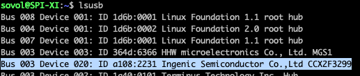

# What I modded and why

## PEI Sheet

The shipped Sheet is ok-ish, but far from usable like charm. So I switched to the LDO Motors Spare-Pei for Voron 2.4 350mm.

## Filament holder

That's a topic not everyone has, but as it's not my only printer, I have filament in boxes or dryer boxes, so I got rid of the spool holder and modified the filament sensor mechanism to my needs.
A model that even adds a filament cleaner can be found (later) inside the models folder.

## Feeds

I have created some bamboo-ish feed made of TPU that worked better against that movement noises.
Although I have designed a base for the self-aligning anti-vibration [Hula feed (by thrutheframe) ](https://makerworld.com/en/models/417509#profileId-319901) to attach the SV08 to the Voron version. Model can be found in Mods/Hula Feed

## MCU FAN

The shipped fan is really noisy. I swapped it with a Noctua 24V 4010 as 1:1 replacement. But I even got enough external airflow below my printer.

## Housing

Due to the fact that i completed my order of the SV08 on launchday in the first 20 seconds, I ordered only the base machine. Later I ordered the housing.
But even if I received my SV08 end of may, as one of the first europe's retail units. I don't have the housing today. So i took the cart of the shipping box, modified it with some foil and mounted it to the printer.
I have not counted with that long time to drive that solution.

## Printhead

I would lie if i say i love that printhead, but even if i have a complete spare stealthburner printhead laying around, I did not have gone that way till today.
Mostly because, i would want to use the existing printhead electronics like in my voron 2.4 as both have can boards, so i would need to design a extruder part to fit the given board and extruder style. Because why should I attach a standard cw2 when the planetary gears system is not that bad.

## Second Cam

In my eyes, the position of the shipped cam is not the best to have a good view. So I added a second cam for the top view.
As the Creality K1 BuzzwordBingo-Cam is a tiny, inexpensive HD cam with a not the worst look. I checked the pinout of the k1 boards, saw that it seems they prototyped the board with a normal usb-a socket in place, but on the retail boards just replaced it with the same tiny socket as the cam has. Same for another usb port directly beside it. So I ordered that cam and did some checks if that's really a usb port. And that's true. So I took one of my spare USB to that socket cables from my Watercooling, mine was from Aquacomputer but there are enough other brands that build the same cables.
If you test your cam ob a windows system you won't have luck, you will get that unknown usb thing. But on linux you will have a Ingenic Semiconductor device in your usb list. 

Works as expected, just add a cam2 same like the first, change the port to 8081 same for the other port, set res up to 1920x1080 and save restart
In your WebUI add a second cam set it to the sameurls just add a 2 before the ? and you should see a second cam.