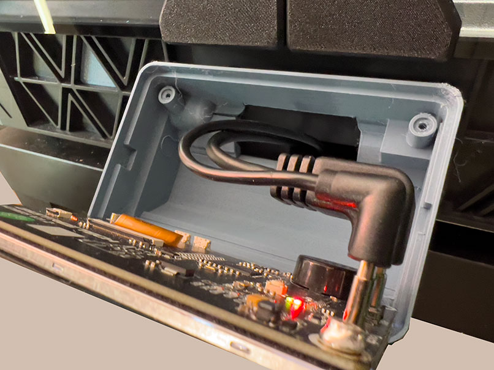
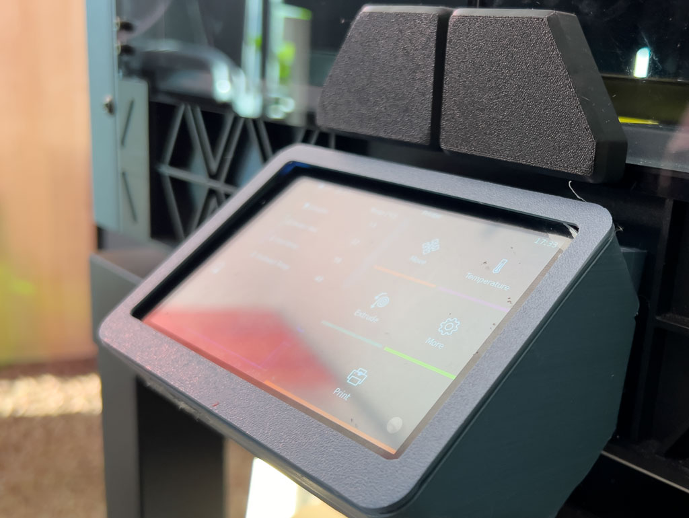

# Sovol SV08 BTT HDMI5 Display Case

Tested and useable display case to be able to use the Bigtreetech HDMI5 Display in version 1.2 (Backside connectors) with the Sovol SV08 printer.

## Files
SV08BTTHDMI5v1_2.3mf - Orca Project

Display_Faceplate.3mf
Display_Base.3mf

Display_Faceplate.stl
Display_Base.stl

SV08_BTT-HDMI5_CASE_PLA_0.2_3h14m.gcode

## Print settings
* 4x Walls
* 5x TopLayers/Bottomlayers
* 20-40 Infill
* Tree support
* Pla

No Commercial use
created by Mommel